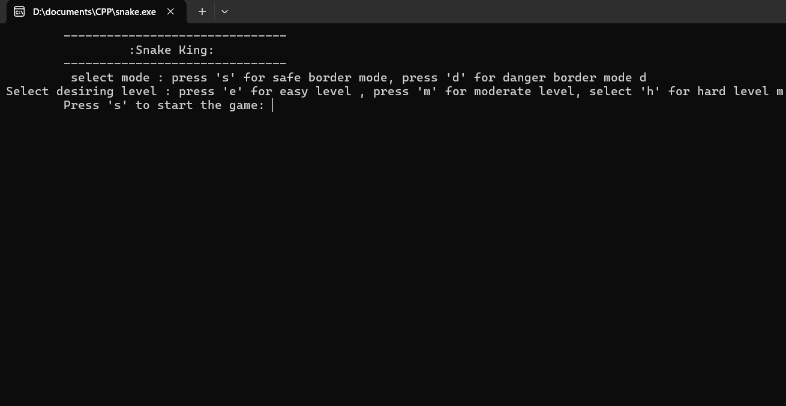
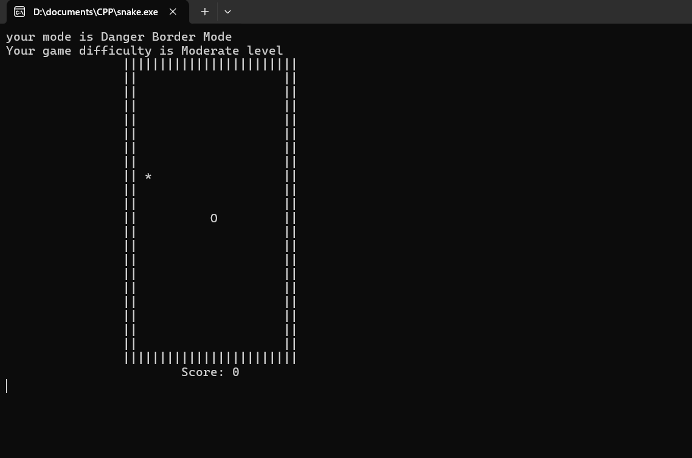
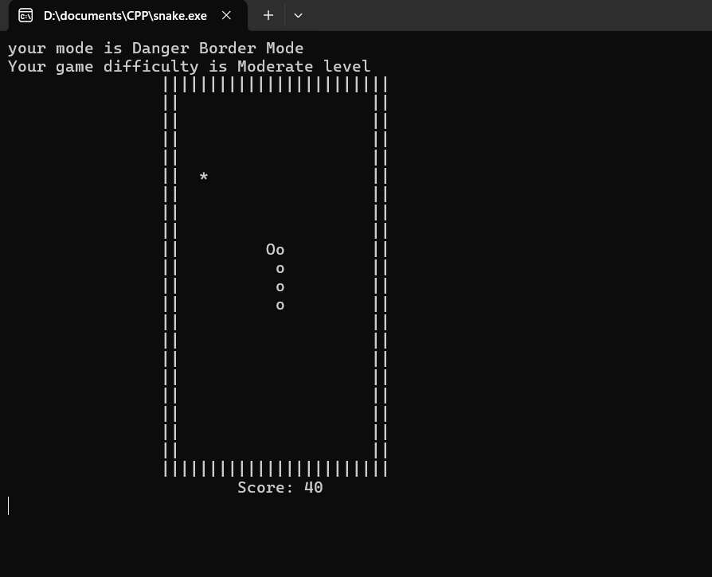
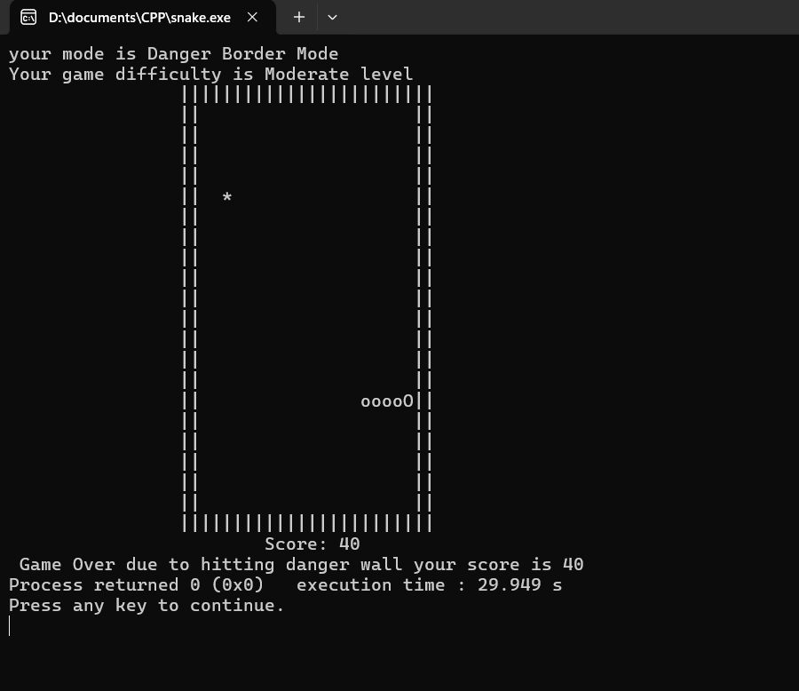
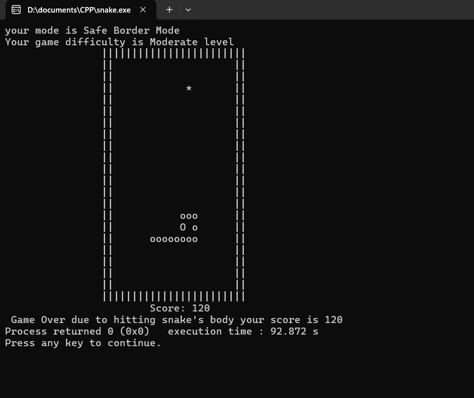

# Snake_Game
This is my project repository. It contains the code of customised Snake Game which I have developed  

## Description
Designed Snake Game using Cpp. It is not an ordinary simple game. I have included many modes and levels in this game conditionally. This game is very customized and responsive. 

## Technology used
- C++

## Libraries used
- Conio.h, to access getch() function and _kbhit() function
- Windows.h. to access sleep() function

## Data Structure used
- An array

## Output

### Selecting Mode and Difficulty

### Initial stage

### While playing

### Game over due to hitting snake

### Game over due to danger border

